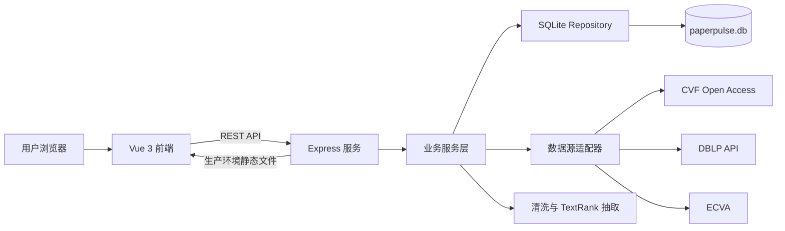
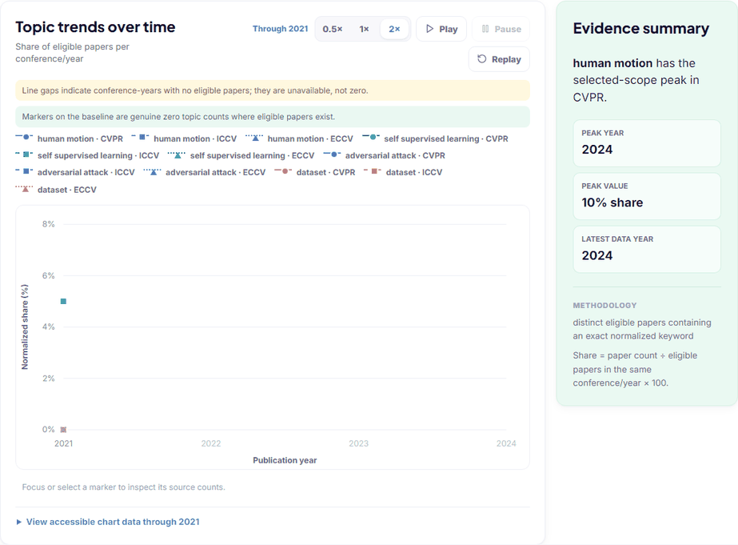
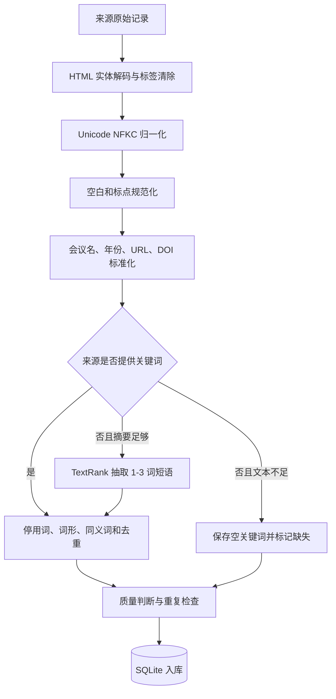

# 阶段二：编程实现与部署

> 本节记录 PaperPulse 从交互原型到可运行 Web 系统的实现过程。项目代码由本人在理解需求和原型的基础上重新编写，Figma 仅用于页面原型设计和交互验证，没有使用 Figma、墨刀、Axure 等原型工具生成项目代码。
>
> 项目仓库：[请替换为 CodeArts 仓库链接]
>
> 在线访问：[请在完成华为云部署后替换为公网链接]
>
> 代码规范：[PaperPulse 代码规范](../codestyle.md)

## 1. 基础功能实现

### 1.1 Web 技术与框架选型

PaperPulse 采用前后端分离的 Web 架构。开发环境中，前端由 Vite 启动，并将 `/api` 请求代理到 Express；生产环境中，Vue 构建产物和 API 由同一个 Node.js 容器提供，从而避免跨域配置和多服务部署带来的额外复杂度。

| 层次 | 技术 | 选择原因 |
| --- | --- | --- |
| 前端 | Vue 3、Vue Router、Vite | 组件化组织清晰，适合仪表盘、多页面筛选和响应式状态更新；Vite 构建速度快 |
| 图表 | Vue 计算属性 + 原生 SVG | 直接控制坐标、折线路径、缺失点断线、标记形状和逐年揭示，动画状态可解释 |
| 图谱 | Vue 组件 + 原生 SVG | 可控制节点布局、缩放、拖拽、悬停和点击联动，满足关键词图谱交互需求 |
| 后端 | Node.js 22、Express | 与前端统一使用 JavaScript，API 路由和异步网络请求实现简洁 |
| 页面解析 | Cheerio | 以类似 jQuery 的选择器解析 CVF、ECVA 公共页面，便于隔离不同来源的解析规则 |
| 数据库 | SQLite | 单文件、免安装、支持事务和索引，适合课程项目及单机华为云 ECS 部署 |
| 部署 | Docker、Docker Compose | 固化 Node.js 版本和构建过程，通过数据卷保存 SQLite 数据 |
| 测试 | Node.js Test Runner | 不额外引入测试框架即可完成领域逻辑、数据库和 API 的离线测试 |

系统整体结构如下：



我没有让页面直接访问外部论文网站，而是把数据源差异收敛在 `cvfAdapter`、`ecvaAdapter` 和 `dblpAdapter` 中。上层搜索服务只面对统一的数据结构，因此后续增加新的公开来源时，不需要修改前端和主要业务流程。

选型时我没有为了“技术先进”盲目引入微服务、Redis、Elasticsearch或图数据库。当前项目的数据规模、团队人数和部署目标都是单机课程应用，SQLite 的 JSON 查询、索引和事务已经能够支持论文管理与共现统计；单体容器也能明显降低华为云部署、备份和故障定位成本。与此同时，我通过适配器、Service 和 Repository 保留了清晰边界，未来数据量增大时可以分别替换搜索引擎、数据库或任务队列。这种“实现保持简单、边界允许演进”的方案比一次性堆叠基础设施更符合本项目阶段。

从功能角度看，系统不是五个互相独立的页面，而是一条可追溯的数据链：

```text
公开来源 -> 候选确认 -> 清洗/抽取 -> 质量判定 -> 持久化
        -> 热门方向 -> 关键词图谱 -> 趋势对比 -> 相关论文阅读
```

同一条论文记录可以从来源页面追溯到清洗结果，再追溯到它对热点、图谱和趋势统计的贡献，避免“首页一个口径、图表又是另一个口径”的数据孤岛。

### 1.2 原型基础功能实现（功能 1～5）

#### 1.2.1 功能 1：论文信息爬取

单篇论文检索的流程为：用户输入完整或部分标题，后端并行请求 CVF Open Access、ECVA 和 DBLP，清洗各来源结果后计算标题相似度，合并重复候选项并排序。页面先展示来源、会议、年份和匹配度，只有用户确认候选项后，系统才继续访问详情页并写入数据库。这样可以避免模糊标题直接造成错误入库。

批量导入支持三种输入方式：上传 CSV、上传 TXT、直接粘贴标题列表。CSV 优先识别 `title` 或 `paper title` 表头，否则读取第一列；TXT 和粘贴输入均按“一行一个标题”解析。系统为每次导入建立持久化任务，逐条显示 `pending`、`processing`、`successful`、`duplicate`、`missing_fields` 或 `failed` 状态。单条失败不会终止整个批次，失败项可以在任务完成后单独重试。

核心调度逻辑如下。并发数由配置控制，每条任务都独立更新状态，因此既能限制外部请求压力，也能保留清晰的执行记录。

```js
async function runPool(items, concurrency, worker) {
  let cursor = 0
  const runners = Array.from(
    { length: Math.min(concurrency, items.length) },
    async () => {
      while (cursor < items.length) {
        const index = cursor
        cursor += 1
        await worker(items[index])
      }
    }
  )
  await Promise.all(runners)
}

async process(jobId) {
  this.repository.setImportJobStatus(jobId, 'processing')
  const items = this.repository.listImportItems(jobId, ['pending'])
  await runPool(items, this.config.importConcurrency,
    (item) => this.processItem(jobId, item))
  this.repository.setImportJobStatus(jobId, 'completed')
}
```

爬取结果包括题目、会议、年份、作者、摘要、关键词、DOI、原文链接和数据来源。若公开来源没有提供关键词，但摘要长度满足要求，系统会使用 TextRank 自动抽取，并将 `keyword_provenance` 标记为自动生成，避免把机器抽取结果误认为作者关键词。系统不会凭空生成缺失摘要。

> 【插入图片：单篇论文检索及候选结果】
>
> 【插入图片：CSV/TXT 批量导入】
>
> 【插入图片：批量任务进度与失败重试】

#### 1.2.2 功能 2：论文列表管理

论文库支持新增、查看、编辑、删除四类操作。新增和编辑都会经过同一套清洗、字段校验和重复检查；删除前展示确认弹窗，删除后相关导入记录会解除关联，统计页面也会立即排除该论文。

查询由服务端 SQLite 完成，不是只过滤当前页。用户可以对论文编号、标题、作者和关键词进行不区分大小写的模糊查询，并叠加会议、年份、数据质量、来源、排序方式和分页条件；从全局搜索进入论文库时，还支持精确作者筛选。所有用户输入都以 SQL 参数绑定，排序字段使用固定白名单映射，避免把查询文本直接拼接到 SQL 中。

当本地列表没有匹配项时，空状态会显示“Search public sources”。点击后，查询词通过路由参数带入论文导入页，并自动填充到单篇检索框；用户可以联网查询候选结果，确认后加入论文库。这一设计满足“本地不存在时联网查询”的要求，同时保留人工确认步骤，防止相似标题被误收录。

数据库设置了多层去重规则：

```text
主规则：normalized_title + conference + year
辅助规则：DOI
辅助规则：source_name + source_record_id
辅助规则：canonical_url
```

重复导入不会生成第二条论文记录，而是返回已有记录；后续抓取到更完整的信息时，可以更新原先不完整的数据。

> 【插入图片：论文列表、筛选与分页】
>
> 【插入图片：新增/编辑论文弹窗】
>
> 【插入图片：本地无结果后跳转公共来源查询】

#### 1.2.3 功能 3：Top 10 热门方向分析

热门方向不是前端写死的模拟数据，而是由后端实时统计 SQLite 中满足分析条件的论文。默认返回 Top 10，支持按会议、年份和关键词名称过滤，并可按论文数、样本占比或同比增长排序。

统计单位定义为“包含该标准化关键词的不同合格论文数”。即使一篇论文的异常数据中重复出现同一关键词，也只计数一次。只有摘要非空、关键词非空且状态不是 `fetch_failed` 的论文才参与分析。

```text
paper_count = 包含该关键词的不同合格论文数
eligible_paper_total = 当前会议和年份范围内的全部合格论文数
share_percent = paper_count / eligible_paper_total * 100%
growth_percent = (本年论文数 - 上年论文数) / 上年论文数 * 100%
```

若上一年为 0，增长率返回 `null`，而不是用“无限增长”或 100% 代替。并列项按关键词字母序进行稳定排序，使相同数据每次返回的名次一致。点击某个热门方向后，页面会展示其相关论文和历年变化。

需要说明的是，这里的“热门”表示当前数据库样本中的出现频率和占比，是描述性统计，不代表论文质量、学术重要性或因果关系。

> 【插入图片：Top 10 热门方向排行榜】
>
> 【插入图片：某一热门方向的详情和相关论文】

#### 1.2.4 功能 4：关键词图谱

关键词图谱采用无向共现网络：节点表示标准化关键词，节点大小对应包含该词的论文数；一条边表示两个关键词至少在同一篇合格论文中出现过，边的权重为共同出现的论文数。为减少高频词对图谱的误导，系统还计算 Jaccard 相似度：

```text
Jaccard(A, B) = 共现论文数 /
                (包含 A 的论文数 + 包含 B 的论文数 - 共现论文数)
```

用户可以按会议、年份、最小节点频次和最小边频次筛选图谱。点击节点后，前端以该关键词为焦点重新请求网络，并展示直接相关关键词和相关论文；支持拖拽、缩放和悬停查看详细数值。后端通过 `source_topic.topic < target_topic.topic` 固定边的方向，避免同时产生 A-B 和 B-A 两条重复边。

图谱统计与 Top 10 使用相同的数据清洗和合格论文口径，保证不同页面之间的数据能够相互解释。

> 【插入图片：关键词图谱全局视图】
>
> 【插入图片：点击关键词后的聚焦视图与相关论文】

#### 1.2.5 功能 5：热度走势对比动图

热度走势页限定在 CVPR、ICCV、ECCV 三个会议中比较。用户可以选择 1～5 个关键词、一个或多个会议、起止年份以及“论文数/样本占比”指标。后端返回完整的“关键词 × 会议 × 年份”矩阵，前端再按年份逐步揭示已有数据点。

动图提供播放、暂停、重播和 `0.5x / 1x / 2x` 三档速度。实现时没有生成或外推不存在的数据：某会议在某年有合格论文但没有目标关键词时记为真实的 0；若该会议当年根本没有合格论文，则该点标为不可用并断开折线。这样可以避免将“没有数据”误画成“热度为零”。

播放的核心状态由 `visibleYear` 控制，每个定时周期只把可见年份推进一格：

```js
function advancePlayback() {
  const index = animationYears.value.indexOf(visibleYear.value)
  if (index < 0 || index >= animationYears.value.length - 1) {
    stopPlayback()
    return
  }
  visibleYear.value = animationYears.value[index + 1]
  if (visibleYear.value === animationYears.value.at(-1)) stopPlayback()
}

function startPlayback() {
  window.clearInterval(playbackTimer)
  playing.value = true
  playbackTimer = window.setInterval(
    advancePlayback,
    playbackBaselineMs / playbackSpeed.value
  )
}
```

趋势图没有直接套用现成图表模板，而是根据后端矩阵使用原生 SVG 计算坐标和折线路径。图表使用颜色区分关键词，用线型和点形区分会议，并附有可展开的数据表。自定义绘制让我能够明确控制缺失点断线、真实零值、可见年份和无障碍数据表。GIF 由实际页面播放过程录制，博客中展示的是系统真实交互，不是单独制作的演示动画。


>
> 【插入图片：趋势筛选器、峰值摘要和底层数据表】

### 1.3 平台兼容性与数据持久化

前端使用标准 Web API 和响应式布局，可在现代 Chrome、Edge、Firefox 等浏览器中访问；后端固定使用 Node.js 22.5 及以上版本，因为项目使用了 Node.js 内置 SQLite API。所有运行参数均通过环境变量配置，代码中没有依赖个人电脑的绝对路径。

SQLite 数据库默认位于 `server/data/paperpulse.db`。数据库初始化采用版本化迁移，重复执行不会删除既有数据。主要数据表包括：

| 数据表 | 作用 |
| --- | --- |
| `papers` | 保存论文正文信息、来源、质量状态和关键词来源 |
| `search_candidates` | 临时保存待用户确认的联网候选项，并设置过期时间 |
| `import_jobs` | 保存批量任务总体状态 |
| `import_items` | 保存批量任务中每一行的状态、错误和结果论文 ID |
| `response_cache` | 缓存公开来源的成功响应，减少重复访问 |

批量导入记录同样写入 SQLite。服务器重启时，系统会扫描未结束任务，把中断于 `processing` 的条目安全恢复为 `pending` 并继续执行；已经成功、重复或明确失败的条目不会重复处理。

生产部署使用多阶段 Dockerfile：第一阶段构建 Vue，第二阶段安装后端生产依赖，最终镜像只包含运行所需文件。SQLite 位于名为 `paperpulse-data` 的 Docker 数据卷中，因此重建容器不会丢失论文数据。

```bash
docker compose up -d --build
docker compose ps
curl --fail http://127.0.0.1:3000/api/health
```

部署到华为云 ECS 后，还需要配置安全组、域名和 HTTPS 反向代理，对外只开放 80/443 端口。当前实现是单机部署方案，批量任务执行器运行在进程内，因此不应直接扩展为多个并行后端副本；如果后续需要水平扩容，应把任务队列迁移到独立消息队列，并将 SQLite 替换为服务型数据库。

> 华为云访问地址：[部署完成后填写]
>
> 【插入图片：华为云 ECS / CodeArts 部署成功页面】
>
> 【插入图片：公网首页和 `/api/health` 检查结果】

### 1.4 实现规范

本阶段遵循以下约束：

1. 原型只作为需求与视觉参考，所有 Vue、CSS、Express 和数据库代码均在项目仓库中重新实现，没有使用原型工具导出代码。
2. 前端页面、业务服务、数据源适配器、领域清洗和持久化层分离，避免把爬虫、统计和界面逻辑写在同一文件中。
3. API 对参数类型、范围和重复参数进行校验；SQL 查询使用参数绑定，排序只允许白名单值。
4. 不伪造缺失摘要和论文数据；自动抽取的关键词保存来源说明，并在详情页明确标识。
5. 爬取仅用于课程教学，遵守公开站点的 `robots.txt`，设置明确 User-Agent、并发上限、同源请求间隔、超时、缓存和有限重试，不绕过登录、验证码或访问控制。
6. 数据库、缓存、构建产物和本地环境文件通过 `.gitignore` / `.dockerignore` 排除，不把本机运行数据提交到仓库。
7. 错误状态不只输出到控制台。页面分别呈现加载、空数据、部分失败、可重试失败和字段缺失状态。

截至本节撰写时，离线测试覆盖数据源解析、清洗、TextRank、重复检测、导入恢复、CRUD、查询、热门方向、关键词图谱、趋势 API 和生产静态服务等功能。实际执行结果为 **90 项测试全部通过**，前端生产构建成功，共转换 **1616 个模块**。

```text
# tests 90
# pass 90
# fail 0

vite v6.4.3 building for production...
✓ 1616 modules transformed.
✓ built successfully
```

## 2. 数据获取与处理

### 2.1 论文数据来源

项目使用的论文元数据均来自公开页面或公开 API，具体来源如下：

| 来源 | 获取方式 | 主要字段 |
| --- | --- | --- |
| CVF Open Access | 读取 CVPR/ICCV 年度索引页，再读取用户确认论文的详情页 | 标题、会议、年份、作者、摘要、原文链接、部分 DOI |
| ECVA | 读取公开论文索引，再读取 ECCV 论文详情页 | 标题、年份、作者、摘要、原文链接、部分 DOI |
| DBLP | 调用公开 publication search JSON API | 标题、会议、年份、作者、DOI、电子版链接、DBLP key |

本项目不抓取 Google Scholar，不下载论文 PDF，也不绕过任何身份认证或反爬机制。DBLP 主要用于候选检索和元数据补充；CVF、ECVA 的官方公开页面优先用于获取摘要等详情。

为了让展示数据可复现，我另外实现了演示数据导入命令。它从 CVPR 2023/2024、ICCV 2021/2023、ECCV 2022/2024 六个会议批次中各抽取 20 篇，共 120 篇真实论文。样本通过官方详情 URL 的 SHA-256 排序后取前 N 条，因此多次运行的选样结果一致。该数据集只是课程演示样本，不代表完整会议论文集，也不能据此推断整个计算机视觉领域的总体分布。

### 2.2 数据清洗与关键词抽取

数据进入数据库前依次经过以下处理：



具体规则如下：

1. 移除 HTML 标签、脚本和样式，解码 HTML 实体。
2. 使用 Unicode NFKC 归一化，统一空白字符和常见标点。
3. 保存可读标题，同时生成小写、去标点的 `normalized_title` 用于匹配和去重。
4. 将会议名称统一为 `CVPR`、`ICCV` 或 `ECCV`，年份限制在有效范围内。
5. URL 去除 fragment 和常见跟踪参数，DOI 去除网址前缀并转为小写。
6. 关键词经过小写化、停用词过滤、简单词形归一、同义词映射和去重。
7. 缺失摘要保持为 `null`，不使用 AI 补写；缺失关键词只有在摘要不少于 20 个英文单词时才执行 TextRank。

TextRank 首先在句子内按四词窗口建立无向加权词图，然后以阻尼系数 0.85 迭代 PageRank，最多迭代 100 次，收敛阈值为 `1e-8`。系统从连续词中形成 1～3 词候选短语，短语得分为词得分之和除以词数平方根；如果候选短语全部出现在标题中，再乘以 1.5。最终最多保留 8 个不互相包含的短语。

```text
phrase_score = sum(token_rank) / sqrt(token_count)
title_bonus = 1.5（短语中的词均出现在标题时）
```

TextRank 的优点是无需额外训练语料、结果可追溯且能够离线运行；局限是对摘要长度和文本质量较敏感，因此系统保留每个候选词的分数、算法版本和输入字段，方便人工检查。来源本身提供的关键词始终优先于自动抽取结果。

### 2.3 数据统计与入库

数据入库前会先进行精确键和近似标题匹配。搜索阶段的相似度综合考虑标准化编辑相似度、词集合重合度和标题包含关系，精确标准化标题始终排在模糊匹配之前。用户确认后才抓取详情并写入正式论文表。

每条论文根据完整性被标记为：

| 状态 | 含义 | 是否参与分析 |
| --- | --- | --- |
| `complete` | 标题、会议、年份、摘要、关键词、原文链接完整 | 是 |
| `missing_fields` | 已保存，但至少一个完整性字段缺失 | 仅摘要和关键词均存在时才可参与 |
| `fetch_failed` | 候选项已保留，但详情页获取失败 | 否 |
| `duplicate` | 导入结果指向已有论文，不产生第二条记录 | 不形成新记录 |

统计接口都从 SQLite 实时读取，Top 10、图谱和趋势共用相同的“合格论文”判断，避免同一篇论文在不同页面中使用不同口径。对于走势对比，系统同时返回分子 `paper_count` 和分母 `eligible_paper_total`，前端既可以显示原始论文数，也可以显示按当年样本规模归一化的占比。

演示数据在本地完成过一次可复现验证：六个会议批次各 20 篇，共 120 篇，均包含真实摘要、作者、来源链接、抓取时间和带来源标识的 TextRank 关键词。这里记录的是本地验证结果，不等同于已经完成华为云部署，也不代表三大顶会的完整数据。

## 3. 关于扩展功能

### 3.1 可扩展功能说明

在完成五项基础功能后，我把扩展方向分为“增强用户理解”和“增强系统可靠性”两类：

| 扩展功能 | 价值 | 当前状态 |
| --- | --- | --- |
| 全局搜索 | 同时搜索论文、作者和关键词，并跳转到对应页面 | 已实现 |
| 数据质量状态 | 展示缺失字段、抓取失败和分析资格，避免错误数据静默进入统计 | 已实现 |
| 论文详情上下文 | 在详情页展示关键词排名、相关关键词和相关论文 | 已实现 |
| 导入历史与断点恢复 | 服务重启后恢复未完成批次，可查看和重试失败项 | 已实现 |
| “了解更多”页面 | 介绍三大顶会、数据来源、统计口径和局限 | 已实现 |
| 年度热词演变榜单 | 按年份播放 Top 10 排名升降，形成类似 bar chart race 的效果 | 待扩展 |
| 导出研究报告 | 将筛选结果、图谱和走势导出为图片或 PDF | 待扩展 |

这些功能没有改变“小刚快速了解计算机视觉研究热点”的核心目标，而是补足了“数据从哪里来”“结果是否可信”“如何继续阅读论文”三个问题。

### 3.2 扩展功能实现与博客记录

#### 扩展功能一：跨实体全局搜索

顶部搜索框可同时检索论文编号/标题、标准化关键词和作者。后端分别返回 `papers`、`topics`、`authors` 三组结果，每组按照“完全匹配 → 前缀匹配 → 部分匹配”排序。输入不足两个字符时不请求，前端设置 300 ms 防抖，并用请求序号阻止旧响应覆盖新响应。

点击论文进入详情页，点击关键词进入热门方向页，点击作者进入带作者精确筛选的论文库。这使搜索不只是查找文本，而是整个平台的导航入口。

> 【插入图片：全局搜索的论文/关键词/作者分组结果】

#### 扩展功能二：论文详情上下文

详情页除展示摘要、作者和原文链接外，还提供论文在当前会议和年份中的主题上下文：主要关键词热度、相关关键词共现关系、相似论文以及关键词来源。所有相关结果均来自数据库中的精确标准化关键词，不使用字符串包含关系伪造关联。

> 【插入图片：论文详情、关键词来源和相关论文】

#### 扩展功能三：数据质量与可解释统计

系统没有把“抓到一条记录”简单等同于“可用于统计”。论文详情会列出缺失字段和排除原因；概览页展示完整、字段缺失、抓取失败的数量与完整率；统计页同时展示样本分母、更新时间和来源。这个扩展降低了小样本、来源覆盖不同或缺失摘要对结论造成误导的风险。

> 【插入图片：数据质量状态与统计口径说明】

#### 扩展功能四：持久化导入历史与恢复

批量导入任务不是只保存在页面内存中。刷新页面后可以重新打开最近任务；服务器异常退出并重启后，系统会恢复未结束条目，并保持已经完成的结果。恢复日志只记录任务 ID、状态和数量，不打印论文标题或来源正文。

> 【插入图片：历史任务列表与恢复后的任务状态】

### 3.3 关键难点与解决过程

#### 难点一：多个公开来源的字段质量不一致

最初的直接做法是“搜到第一条就保存”，但实际测试中出现了同名论文、DBLP 缺少摘要、官方详情页临时失败等情况。如果直接入库，错误候选会污染后续全部统计。最终方案将流程拆成“搜索候选”和“确认详情”两阶段：搜索阶段只保存有过期时间的临时候选；用户确认后才访问详情页并入库。多个数据源使用 `Promise.allSettled` 并发访问，一个来源失败时仍可返回其他来源结果，同时在响应中保留 `source_errors`。这一改动牺牲了一次点击的速度，却换来了更高的数据准确性和可解释性。

#### 难点二：缺失数据会让趋势图产生错误结论

在趋势功能的早期设计中，所有缺失位置都被初始化为 0。这在视觉上很完整，但含义是错误的：ECCV 和 ICCV 并非每年举办，某年数据库没有样本也不等于关键词热度为零。最终我为每个点同时保存 `paper_count`、`eligible_paper_total` 和 `has_data`。有分母但关键词未出现才是 0；没有合格论文时返回 `null` 并断线。这个修正使动画不再只是“好看”，而是能够诚实表达数据边界。

#### 难点三：批量任务刷新或重启后状态丢失

如果批量进度只保存在 Vue 状态中，页面刷新后用户无法判断任务是否仍在运行；如果进程在条目处理中退出，还可能重复导入。我的解决方案是将任务和条目状态全部写入 SQLite，并在启动时执行恢复扫描：将中断的 `processing` 条目重置为 `pending`，保留所有终态条目，再通过进程内运行任务表避免同一个任务被重复调度。前端轮询也采用“上一请求结束后再安排下一次”的顺序方式，并用请求序号丢弃过期响应，解决了慢响应覆盖新状态的问题。

上述三个问题也体现了本阶段与 AI 编程助手协作时的分工：AI 更适合帮助枚举异常路径、生成测试场景和审查边界条件；最终的数据口径、是否采纳方案以及对用户可见的交互仍由我决定。完整 Prompt、AI 输出摘要、修改理由和对话截图将在后文“AI 结对协作记录”中按案例单独展示，避免只展示一次性生成的最终结果。

## 本阶段小结

阶段二完成了从公开论文数据获取、清洗、关键词抽取、持久化管理到热点分析与可视化的完整闭环。实现过程中，我重点处理了三个容易被忽视的问题：第一，联网检索必须经过候选确认，不能仅凭模糊标题直接入库；第二，所有分析页面必须共用明确的数据资格和统计口径；第三，动图中的缺失数据不能被误画成 0。相比只完成页面展示，这些约束使系统结果更可复现，也更容易解释。

---

## 发布博客前核对（不属于正文）

- [ ] 将 CodeArts 仓库和公网地址替换为真实链接；发布到外部博客时，将 `../codestyle.md` 改为 CodeArts 中该文件的完整网页地址。
- [ ] 确认华为云公网地址可以从校外访问，并保存 `/api/health` 成功截图。
- [ ] 将所有“插入图片/GIF”占位符替换为真实截图；整篇博客至少 10 张图，建议保留本节列出的 16 个展示点。
- [ ] GIF 必须从真实趋势页面录制，能看出年份推进、会议对比和播放控制。
- [ ] 不要把本地 120 篇验证记录写成三大顶会完整数据或线上部署结果。
- [ ] 当前仓库历史可见 14 次 commit，评分要求为 15 次以上；后续应基于真实修改正常提交，不能拆分或伪造 commit。
- [ ] 当前仓库未见 `dev` 分支和 `v1.0.0` tag；完成开发流程后按真实过程补充分支合并、Release、Issue 和 PR 记录。
- [ ] 在整篇博客的 AI 协作章节补齐至少 3 个案例、完整 Prompt、输出摘要、采纳/拒绝理由及多轮对话截图。
